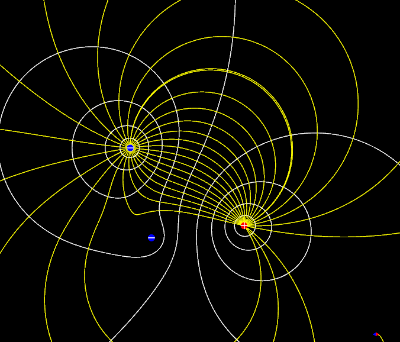
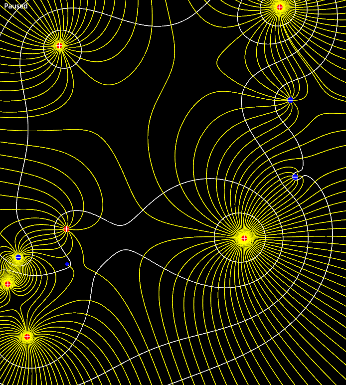

# Fieldsim

  

A graphical simulator for electric bodies in a 2D universe, made for plotting isopotentials and field lines.

## Functionality

Currently there are only 2 electric bodies available:
1. Point charge
2. Dipole

The potential and electric field these generate are of slightly different form to the usual expressions in 3D. In order for Gauss's Law to hold for 2D closed contours, the electric field of a point charge must drop off as 1/r rather than 1/r². Likewise the potential must go as ln(r) rather than 1/r. Everything else follows as expected.

The program plots isopotentials and field lines using a simple adaptive RK4 algorithm, which seems to be quite accurate most of the time. Isopotentials are laid down first, and field lines are then plotted by dividing the isopotentials into segments of equal electric flux, according to [1]. This results in the density of field lines correctly corresponding to the strength of the field.

The program also has rudimentary simulation capabilities, allowing bodies to interact with eachother and move about.

All graphics are plotted using [nannou](https://nannou.cc/).

## Interface

As it stands, the user interface is somewhere between bare and non-existent, depending on how generous you are. The controls are as follows:
* Left click to plot an isopotential
* Right click to clear all isopotentials and field lines
* Press F to plot field lines from all placed isopotentials (painfully slow for more than about 10 isopotentials simultaneously)
* Press Space to toggle the simulation

## Building

There is no trickery afoot here. Simply clone the repo and build/run using Rust's [Cargo](https://doc.rust-lang.org/cargo/index.html).

## References

[1] E. J. Horowitz; A general field‐line plotting algorithm. _Computers in Physics and IEEE Computational Science & Engineering_ 1 July 1990
